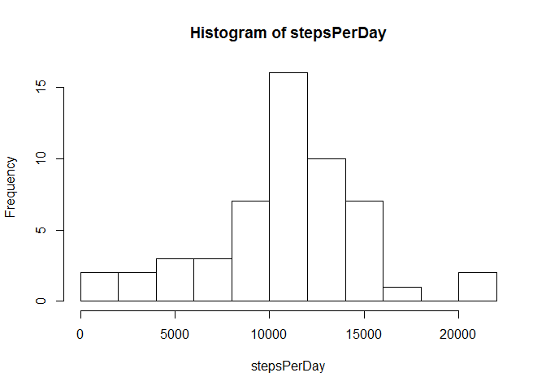
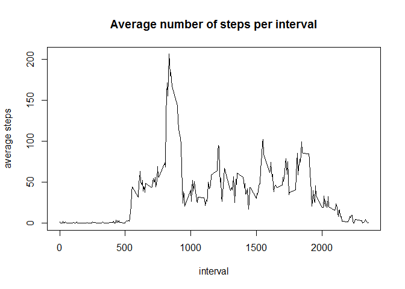
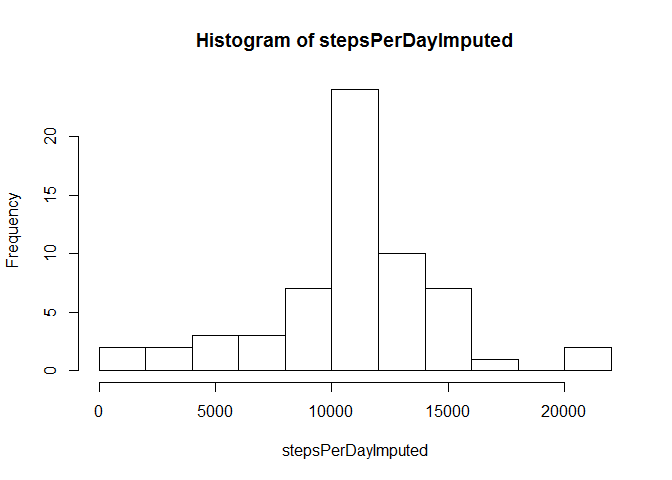
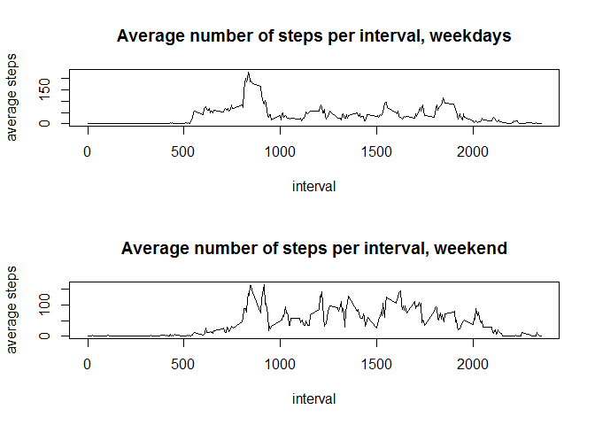

# Exploratory Data Analysis Week2 - Activity Tracking
Keith Swaback  
February 11, 2017  


**=========================================================================================**

#Loading and Preprocessing the Data
<br>
**Assignment requirement 1:** Let's start by loading the activity tracking data and taking a look at it. 

IMPORTANT: the activity.csv file as well as this Markdown document should both be placed in the working
directory, so that the data is loaded correctly.


```r
trackingData <- read.csv("activity.csv")
str(trackingData)
```

```
## 'data.frame':	17568 obs. of  3 variables:
##  $ steps   : int  NA NA NA NA NA NA NA NA NA NA ...
##  $ date    : Factor w/ 61 levels "2012-10-01","2012-10-02",..: 1 1 1 1 1 1 1 1 1 1 ...
##  $ interval: int  0 5 10 15 20 25 30 35 40 45 ...
```
<br>
<br>

# What is the mean total number of steps taken per day?

<br>
**Assignment requirement 2:** Calculate total number of steps taken each day and plot a histogram of this.
Ignore missing values (do not count them as 0 steps, just ignore them altogether)


```r
stepsPerDay <- tapply(trackingData$steps, trackingData$date, FUN = sum)
hist(stepsPerDay, breaks=10)
```

<!-- -->
<br>
<br>
**Assignment requirement 3:** Calculate the mean and median number of steps per day. Ignore missing values
(do not count them as 0 steps, just ignore them altogether.)


```r
mean(stepsPerDay, na.rm = TRUE)
```

```
## [1] 10766.19
```

```r
median(stepsPerDay, na.rm = TRUE)
```

```
## [1] 10765
```
<br>
<br>

#What is the average daily activity pattern?

<br>
**Assignment requirement 4:** Create a time-series showing average number of steps during each five minute
interval of the day. Identify which 5 minute period has the greatest number of steps, print this below the graph.


```r
stepsPerInterval <- tapply(trackingData$steps, trackingData$interval, FUN = mean, na.rm=TRUE)
plot(as.numeric(names(stepsPerInterval)), stepsPerInterval, type = 'l', xlab = "interval", ylab = "average steps", main = "Average number of steps per interval")
```

<!-- -->
<br>
<br>
**Assignment requirement 5:** Identify which 5 minute period has the greatest number of steps.


```r
maxStepsInterval <- which(stepsPerInterval == max(stepsPerInterval))
maxStepsInterval <- names(maxStepsInterval)
maxStepsInterval
```

```
## [1] "835"
```
<br>
<br>

#Imputing Missing values

<br>
**Assignment requirement 6 and 7:** Count number of NA values. Describe strategy to impute missing values. Create a new activity tracking dataset with missing values included.

First, calculcate number of missing values.

```r
sum(is.na(trackingData$steps))
```

```
## [1] 2304
```
<br>

A logical way to impute values would be to replace the NA values with the average value for that interval.
We've already calculated the average values for each interval in "stepsPerInterval" vector. A for loop would
be a straightforward way to do this. Keep in mind that the averages are noninteger values; this doesn't make 
sense physically, but there's no obvious need to round the values either.


```r
trackingDataImputed <- trackingData
for (i in 1:length(trackingDataImputed$steps))
{
  if (is.na(trackingDataImputed$steps[i]) == TRUE)
  {
    temp <- trackingDataImputed$interval[i]
    trackingDataImputed$steps[i] <- unname(stepsPerInterval[as.character(temp)])
  }
}
```
<br>
Create a histogram showing the total number of steps taken each day. Report the mean and median number of steps
taken each day, now that the missing values have been imputed.


```r
stepsPerDayImputed <- tapply(trackingDataImputed$steps, trackingDataImputed$date, FUN = sum)
hist(stepsPerDayImputed, breaks=10)
```

<!-- -->

```r
mean(stepsPerDayImputed)
```

```
## [1] 10766.19
```

```r
median(stepsPerDayImputed)
```

```
## [1] 10766.19
```
<br>
Comparing results with imputed values and without imputed values, we can see that the histogram with imputed values shows many more days in the "average" bin, (i.e. 10,000 - 12,000 steps). This is because, instead of
ignoring days that have no measurements (NA only), we're considering these days to be "perfectly average."
In fact, this also has the effect of centering our average + median values, since we're "adding average days
then computing new averages." So the overall mean and median did not change much when we imputed in values
using our "average value" strategy.
<br>
<br>

#Are there differences in activity patterns between weekdays and weekends?

<br>
**Assignment requirement 8:** Determine whether each date in the dataset falls on a weekday or weekend. Then 
Create a 2-panel plot showing time series of average steps taken in each 5-minute interval, one for weekdays,
one for weekends.

First, we need to write some code to add a column to our dataset to indicate whether a given date is a 
weekend of a weekday. We will use the imputed dataset.


```r
temp <- weekdays(as.Date(trackingDataImputed$date))
temp <- as.factor(temp)
trackingDataImputed$day <- temp
head(trackingDataImputed)
```

```
##       steps       date interval    day
## 1 1.7169811 2012-10-01        0 Monday
## 2 0.3396226 2012-10-01        5 Monday
## 3 0.1320755 2012-10-01       10 Monday
## 4 0.1509434 2012-10-01       15 Monday
## 5 0.0754717 2012-10-01       20 Monday
## 6 2.0943396 2012-10-01       25 Monday
```
<br>

Now, subset the data into weekdays and weekend datasets. Then calculate steps per interval over weekdays and weekends.


```r
weekday <- subset(trackingDataImputed, trackingDataImputed$day == "Monday" | 
                    trackingDataImputed$day == "Tuesday" | trackingDataImputed$day == "Wednesday" |
                    trackingDataImputed$day == "Thursday" | trackingDataImputed$day == "Friday")
weekend <- subset(trackingDataImputed, trackingDataImputed$day == "Saturday" | 
                    trackingDataImputed$day == "Sunday")
stepsPerIntervalWeekday <- tapply(weekday$steps, weekday$interval, FUN = mean, na.rm=TRUE)
stepsPerIntervalWeekend <- tapply(weekend$steps, weekend$interval, FUN = mean, na.rm=TRUE)
```
<br>

Finally, plot the weekdays and weekend average steps in a 2 panel plot.


```r
par(mfrow=c(2,1))
plot(as.numeric(names(stepsPerIntervalWeekday)), stepsPerIntervalWeekday, type = 'l', xlab = "interval", ylab = "average steps", main = "Average number of steps per interval, weekdays")
plot(as.numeric(names(stepsPerIntervalWeekend)), stepsPerIntervalWeekend, type = 'l', xlab = "interval", ylab = "average steps", main = "Average number of steps per interval, weekend")
```

<!-- -->
